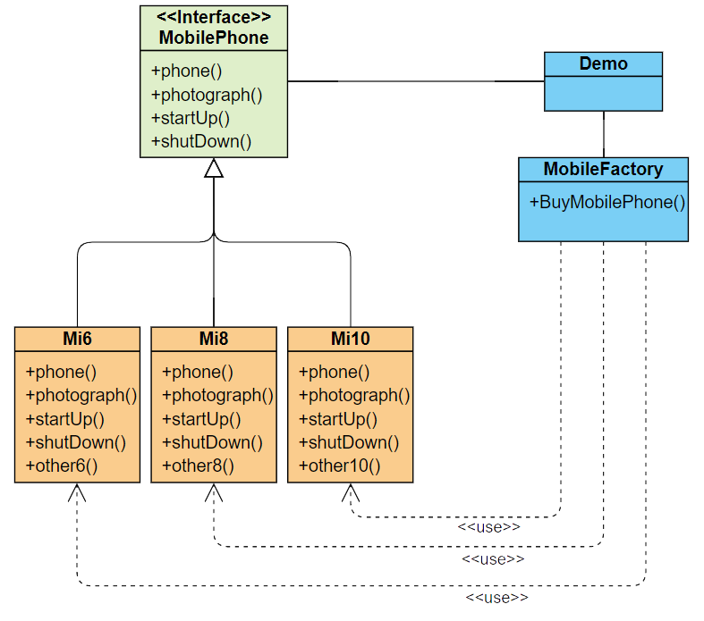

# 工厂模式
## 概括
#### 优点:
 1. 一个调用者想创建一个对象，只要知道其名称就可以了。 
 2. 扩展性高，如果想增加一个产品，只要扩展一个工厂类就可以。
 3. 屏蔽产品的具体实现，调用者只关心产品的接口。
#### 缺点:
* 每次增加一个产品时，都需要增加一个具体类和对象实现工厂，使得系统中类的个数成倍增加，在一定程度上增加了系统的复杂度，同时也增加了系统具体类的依赖。这并不是什么好事。
#### 解决问题:
* 主要解决接口选择的问题。
### 场景举例
1. 日志记录器：记录可能记录到本地硬盘、系统事件、远程服务器等，用户可以选择记录日志到什么地方。 
2. 数据库访问，当用户不知道最后系统采用哪一类数据库，以及数据库可能有变化时。
3. 设计一个连接服务器的框架，需要三个协议，"POP3"、"IMAP"、"HTTP"，可以把这三个作为产品类，共同实现一个接口。

## 如何理解？
#### 首先我们明确2句不证自明的话

1. 工厂是生产某一类产品的地方。
2. 用户给工厂提需求，工厂给用户满足需求的产品。

#### 如何理解这两句话呢？

如果你想用小米手机的话，那就去小米厂子买手机，你只需要告诉小米厂子，你需要什么样的手机，什么型号，或者什么配置，小米厂子把手机做出来给你，你只管用就完事了。

或者手机已经做出来了,比如叫小米10,你直接点名道姓要小米10，工厂给你小米10，不可能你要10给你整个小米6，他要出米11你再买米11。

反正你完全不用操心手机咋造的，并且你肯定知道手机都能打电话开关机拍照等 ~~(除非小米傻了不做打这些功能)~~.

那如果你想买华为就去华为厂子要，想买oppo就去oppo厂子要。

#### 接着我们抽象一下这个场景。

产品/手机 ~~(对象)~~ 为用户所需的东西，工厂就是专门创建 ~~(new)~~ 产品 ~~(对象)~~ 地方，

用户只需要告诉工厂机型/配置 ~~(传参)~~ ，产品 ~~(对象)~~ 的创建 ~~(new)~~ 完全由工厂进行，

用户不需要知道产品 ~~(对象)~~ 创建 ~~(new)~~ 的过程，用户只负责使用 ~~(调用)~~。

#### 然后我们直接java实现这个场景
* 首先我们做一个接口来规范手机的基本功能

[MobilePhone.java](firm\MobilePhone.java)
```java
public interface MobilePhone {
    /**
     * 打电话
     */
    public void phone();

    /**
     * 拍照
     */
    public void photograph();

    /**
     * 开机
     */
    public void startUp();

    /**
     * 关机
     */
    public void shutDown();
}
```
* 然后我们实现这个接口，作为手机 ~~(产品)~~ 的类型。

[Mi6.java](firm\xiaomi\Mi6.java)

[Mi8.java](firm\xiaomi\Mi8.java)

[Mi10.java](firm\xiaomi\Mi10.java)
```java
public class Mi6 implements MobilePhone {
    @Override
    public void phone() {
        System.out.println(this.getClass() + "打电话");
    }

    @Override
    public void photograph() {
        System.out.println(this.getClass() + "拍照");
    }

    @Override
    public void startUp() {
        System.out.println(this.getClass() + "开机");
    }

    @Override
    public void shutDown() {
        System.out.println(this.getClass() + "关机");
    }
}
```

* 现在我们已经有产品类型了，需要一个工厂把产品制造出来给用户
```java
/**
 * 手机工厂
 */
public class MobileFactory {

    /**
     * 用户调用此方法得到手机
     *
     * @param model - 手机型号
     * @return
     */
    public MobilePhone BuyMobilePhone(String model) throws Exception {
        if (model == null) {
            throw new Exception("手机型号为空");
        }
        if ("MI6".equalsIgnoreCase(model)) {
            return new Mi6();
        } else if ("MI8".equalsIgnoreCase(model)) {
            return new Mi8();
        } else if ("MI10".equalsIgnoreCase(model)) {
            return new Mi10();
        } else {
            throw new Exception("手机型号不存在");
        }
    }
}
```
* 这样以来工厂模式代码就结束了，现在只需要用户得到并使用对象就行了

比如[Demo.java](Demo.java)

1.我们需要一个手机
```
MobilePhone mobilePhone;
```
2.我们需要得到一个手机工厂才能得到手机
```
MobileFactory mobileFactory = new MobileFactory();
```
3.然后我们可以通过型号买手机了
```
mobileFactory.BuyMobilePhone("MI6");
```
4.比如我们购买MI6后用它打电话,拍照等
```
mobilePhone = mobileFactory.BuyMobilePhone("MI6");
mobilePhone.startUp();
mobilePhone.phone();
mobilePhone.photograph();
mobilePhone.shutDown();
```
5.或者我们得到一个MI10用MI10打电话,拍照等
```
mobilePhone = mobileFactory.BuyMobilePhone("MI10");
mobilePhone.startUp();
mobilePhone.phone();
mobilePhone.photograph();
mobilePhone.shutDown();
```
* 类图大概就是下面这个歌样子

	
